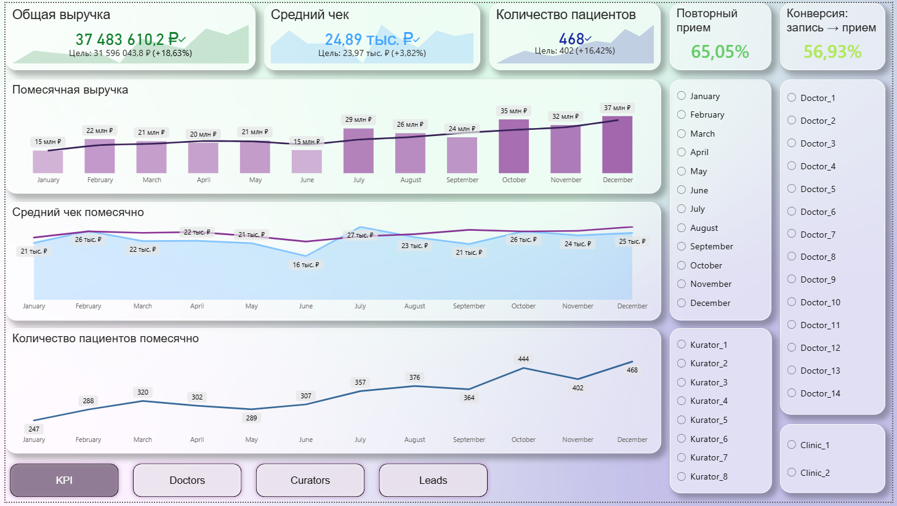
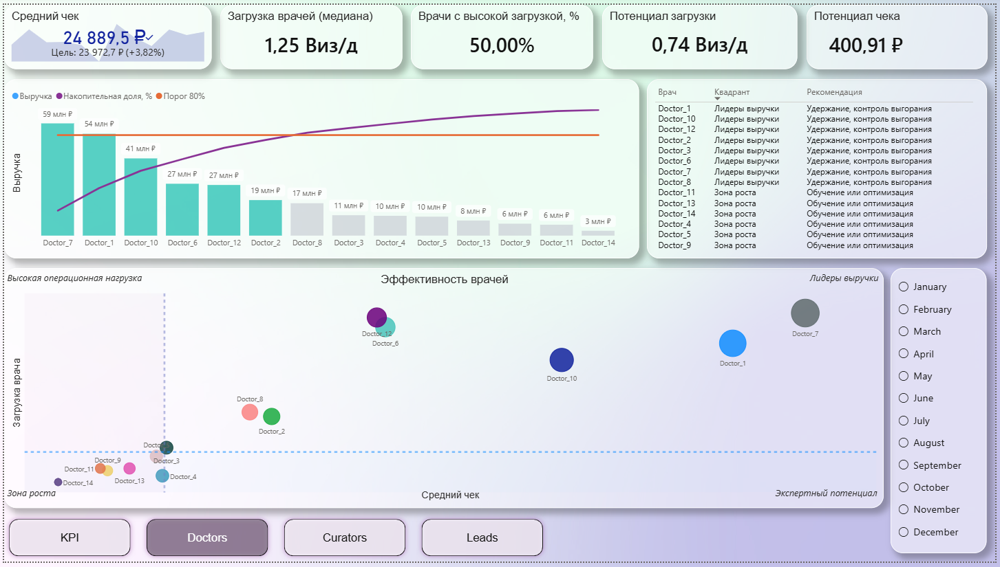
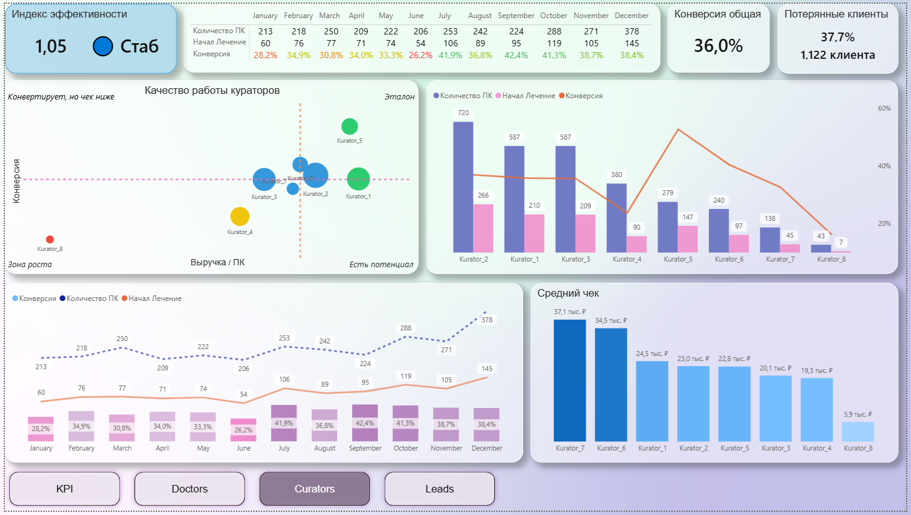
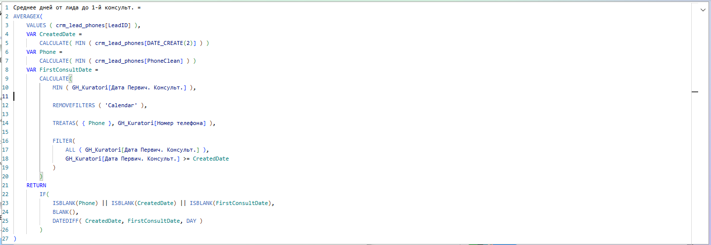
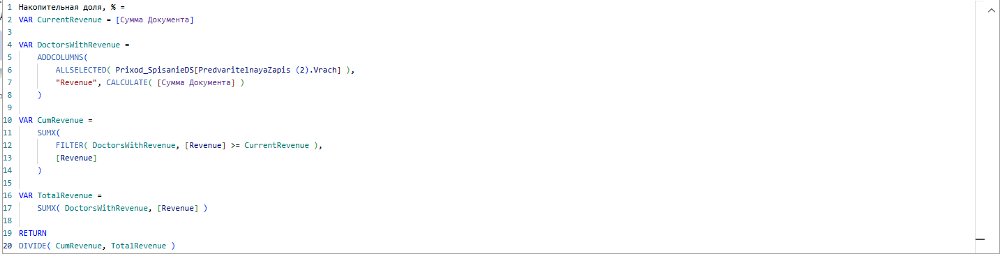
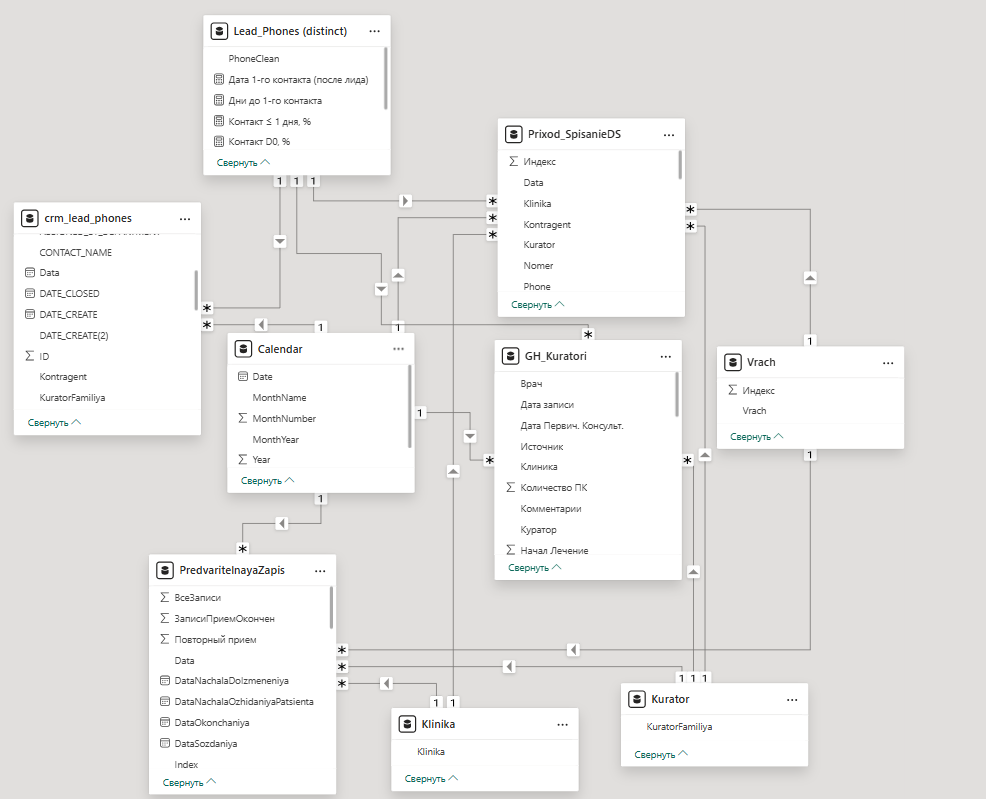

# powerbi-analytics-dashboard
Power BI dashboard for business analytics (portfolio project)

# Power BI аналитический дашборд (портфолио)

Интерактивный аналитический дашборд, разработанный как *портфолио-проект*.  
Проект демонстрирует системный подход к аналитике: от источников данных и ETL-логики до DAX, управленческих метрик и бизнес-ориентированной визуализации.

---

##  Цели проекта

Дашборд отвечает на ключевые управленческие вопросы:

- Где теряются лиды и на каком этапе
- Как скорость обработки влияет на конверсию и выручку
- Какие источники трафика эффективны, а какие — нет
- Какие врачи и кураторы являются лидерами, а где есть потенциал роста
- Где узкие места процесса и зоны для оптимизации

---

##  Архитектура и источники данных

В проекте используется *разделение источников по доменам ответственности*, что снижает связность модели и повышает устойчивость аналитики.

---

### ClickHouse — финансы и медицинские данные

ClickHouse используется как основной аналитический storage для:

- выручки
- контрагентов
- врачей
- клинических и финансовых фактов

#### Выручка

Выручка в ClickHouse **формируется из двух независимых таблиц**:

- Приход денежных средств  
- Списание денежных средств  

На этапе ETL данные объединяются через *UNION*, формируя единый финансовый факт.

Приход ДС
UNION ALL
Списание ДС
→ Финансовый факт

Это позволяет:

 - корректно учитывать все движения денег

 - избежать дублирования бизнес-логики в Power BI

 - централизовать расчёты на уровне SQL

##  ReplacingMergeTree и дедупликация

Таблицы используют движок ReplacingMergeTree.

Особенность:

 - физические дубли могут сохраняться до завершения merge

 - в очереди может находиться 3–5 версий одной записи

Для аналитики это критично, поэтому:

 - дедупликация выполняется явно в ETL / SQL

 - аналитика не зависит от фоновых merge-процессов

 - KPI, медианы и конверсии остаются стабильными

---

# Bitrix24 — лиды и воронка продаж

Bitrix24 используется исключительно для CRM-домена:

 - лиды

 - статусы и этапы обработки

 - источники трафика

 - конверсии

 - скорость реакции

Используется для:

 - анализа воронки лид → запись → приём

 - расчёта конверсий

 - SLA по скорости первого контакта

 - оценки эффективности источников

Особенности данных:

 - часть полей заполняется вручную

 - у первого контакта отсутствует время (только дата)

 - требуется нормализация телефонов

 - возможна асинхронность событий

Bitrix24 не используется для финансовых расчётов.

---

###  Google Sheets — кураторы и управленческая логика

Google Sheets используется как гибкий управленческий слой.

Источник данных для:

 - справочников кураторов

 - целевых и плановых значений

 - SLA и порогов интерпретации

 - управленческих коэффициентов

 - бизнес-классификаций

Почему Google Sheets:

 - быстрая правка без пересборки ETL

 - минимальная нагрузка на модель Power BI

 - прозрачность для бизнеса

 - возможность делегировать управление правилами

Подключение:

 - публикация выбранных листов в CSV

 - прямое подключение Power BI

Итоговое разделение источников
-------------------------------------------
Домен	               /             Источник
- Выручка и финансы	/ ClickHouse
- Врачи и клиника	 / ClickHouse
- Контрагенты / ClickHouse
- Лиды и воронка / Bitrix24
- Кураторы и SLA / Google Sheets

# Структура дашборда

### KPI
 - Выручка и средний чек vs цель
 - Количество пациентов
 - Повторные приёмы
 - Конверсии
 - SLA по скорости обработки лидов

### DOCTORS
 - Распределение выручки
 - Нагрузка vs средний чек
 - Квадранты эффективности (по медианам)
 - Потенциал загрузки и роста

### CURATORS
 - Индекс эффективности куратора (IEK)
 - Выручка / ПК
 - Конверсия
 - Динамика по месяцам
 - Управленческие квадранты

### LEADS
 - Воронка лидов
 - Конверсия лид → запись → приём
 - Скорость первого контакта
 - Scatter: скорость vs конверсия
 - Анализ источников трафика

## Ключевые аналитические подходы

 - Использование медиан вместо средних для устойчивости
 - Scatter-визуалы для поиска управленческих паттернов
 - Квадрантный анализ с бизнес-интерпретацией
 - Нормализация показателей для устранения перекоса по объёму
 - SLA, как управленческая метрика

## Примеры DAX-логики

Ниже приведены примеры вычислений, используемых в дашборде:
- расчет SLA от лида до первого контакта
- накопительная доля выручки (Pareto / 80-20)

## Модель данных

Используется комбинированная модель (звезда / снежинка) с несколькими фактами:
- финансы
- лиды
- записи и приёмы

### Примечание о данных

Все данные:
 - обезличены
 - частично синтетически искажены
 - используются исключительно в демонстрационных целях

### Онлайн-версия дашборда

👉 https://app.powerbi.com/view?r=eyJrIjoiMDFlMmMzNWEtYTNmMy00ZmM5LWFkMzktNzI4NmUxMjljN2RkIiwidCI6IjA0ZTdmY2ZmLTQ5NjUtNGJmMC1iOTA4LTI5NDU1NjRhY2VlZSIsImMiOjl9

 Автор

Сергей Петроченко
Data Analyst / BI Analyst
